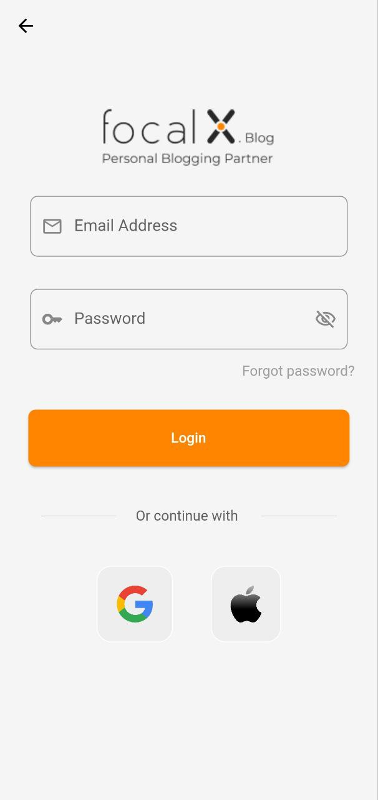
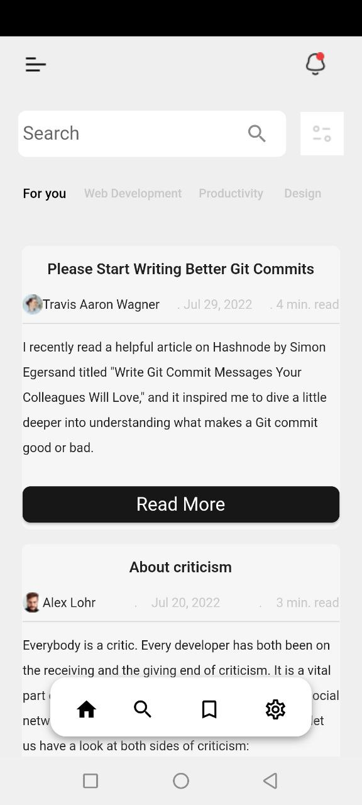
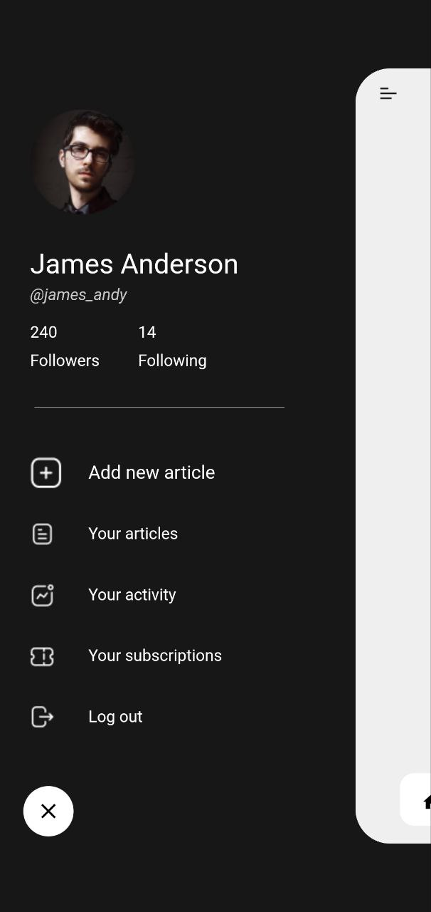

# Flutter Podcast

Blog project made using Flutter framework Training at a company  [focal X agency | فوكال اكس ](https://www.focal-x.com/) 

## Screenshot 

| splach sreen                                             | Welcome screem                                             | Login sreen                         |
| -----------------------------------                      | -----------------------------------                        | ----------------------------------- |
|  |     |   | 

| main screem                                              | Drawer sreen                                               | post screem                          |
| -----------------------------------                      | -----------------------------------                        |  ----------------------------------- |
|      |    |   |

[Download The App Here]([https://github.com/abdulmominsakib/flutter_podcast/releases](https://github.com/hassanentabi/blogger_flutter/archive/refs/heads/main.zip))

