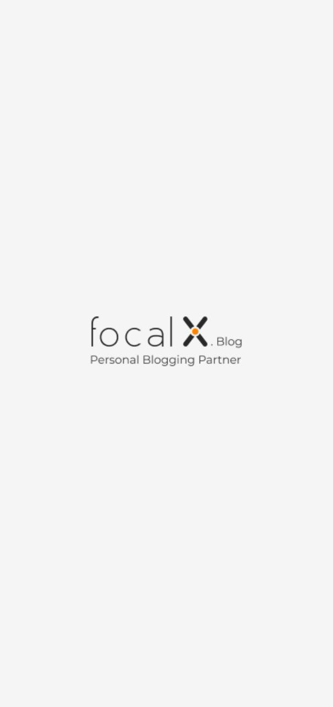

# Flutter Podcast

Blog project made using Flutter framework Training at a company  [focal X agency | فوكال اكس ](https://www.focal-x.com/) 

## Screenshot 

| splach sreen                                             | Welcome screem                                             | Login sreen                         |
| -----------------------------------                      | -----------------------------------                        | ----------------------------------- |
|  |     |   | 

| main screem                                              | Drawer sreen                                               | post screem                          |
| -----------------------------------                      | -----------------------------------                        |  ----------------------------------- |
|      |    |   |

### Want to support?
 
Do you find my work to be of a value for you?
You can buy me a **Book**, or **Coffee**. 

